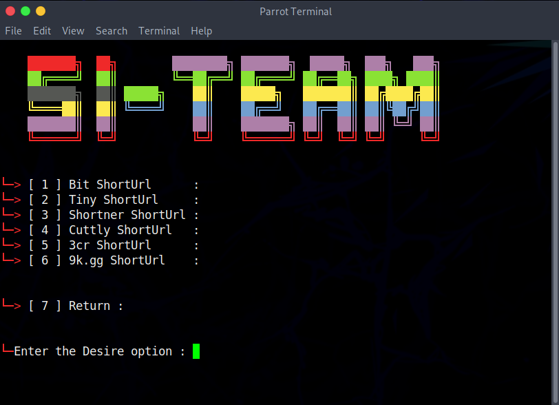

# Advance Shorturl 
 

- What is Advance Shorturl System  ?
> This is url shortner you can give valid link and short it !.
> Many times you just want to give link but url is long so you can do with this shorturl.
> If you find yourself in that situation then this Advance shorturl is the perfect tool for you!
> You can send unlimited send Shorturl to anyone. This awesome scripts works with every links like tiny,cuttly,shorturl,3c5 and many more.
> this tool made by @samay825 

 

- Advance Shorturl Script features 

* `Send unlimited urls and make .`

* `Supports newest Android also.`

* `Instant Link no delay .`

* `Working with all Operators/Carriers.`

* `No missing Link issues, all links will be saved in Yourdata.txt.`

*  For Contact Instagram : sincryptzork

 

- Support

> `termux and all linux os windows.etc..`

> `East to Use.`

> `Tinyurls,cuttlyurls,bitlyurls and more apis.`
 
  

- Installation & Step's
 
> `apt update && apt upgrade`
 
> `git clone https://github.com/samay825/Advance-Shorturl`
 
> `cd Advance-Shorturl`  

> `pip install -r requirements.txt`
 
> `python3 main.py`

 

<h3>Visitors :</h3>
 

